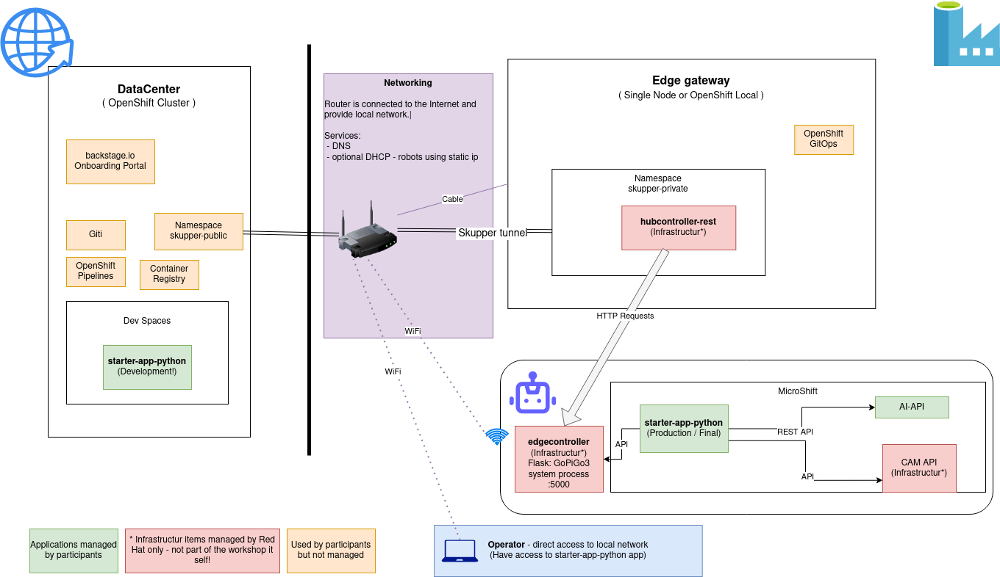

# Cloud Native Robotz Hackathon - Infrastructure

All about infrastructure provisioning for the robot hackathon.

## Overview

|Component (Folder)|Description|
|---|---|
|[datacenter/](datacenter/)|Main OpenShift Cluster for Training and development|
|[edge-gateway/](edge-gateway/)/| Single Node OpenShift to manage all robotz.

