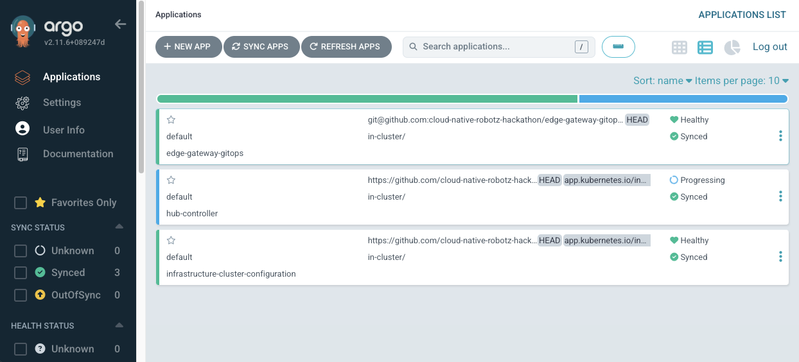

# Local development

The goal is to improve the Workshops with just
 * A cluster at demo.redhat.com (Data Center)
 * OpenShift Local / CRC on your Laptop  (Edge gateway)
 * One Robot

## Prepare the robot

### Connect Robot to your Network (Wired)

* Connect to wired network & findout ip address
* Connect via SSH (wire) to robot
* The robot private keyfile needs to be named ~/.ssh/robot-hackathon
* Hostname should localhost: Set the hostname via
  ```
  echo "192.168.66.70 data.lan" | sudo tee -a /etc/hosts
  ```

### Reset MicroShift at the Robot

At the [cloud-native-robotz-hackathon/infrastructure](https://github.com/cloud-native-robotz-hackathon/infrastructure) repo:

```bash
cd automation
ansible-navigator run ./microshift-reset.yaml -l data.lan
```


## Prepare OpenShift Local / CRC (Edge-Gateway)

### Start OpenShift Local

Minimal requiremntes:
 * 16 GB RAM
 * 8 CPU's
 * 120 GB Root disk

### Fetch credentials

At the [cloud-native-robotz-hackathon/infrastructure](https://github.com/cloud-native-robotz-hackathon/infrastructure) repo:

```bash
cd automation
export KUBECONFIG=$(pwd)/kubeconfig-edge-gateway

crc console --credentials
# Copy past oc admin login command
oc login -u kubeadmin -p xxx-xx-xx-xxx https://api.crc.testing:6443
```

### Deploy / Configure

At the [cloud-native-robotz-hackathon/edge-gateway-gitops](https://github.com/cloud-native-robotz-hackathon/edge-gateway-gitops) repo:


```bash
oc apply -k bootstrap/
# Wait for all pods are ready in openshift-gitops namespace
watch oc get pods -n openshift-gitops

# Add cluster-admin role to ArgoCD
 oc adm policy add-cluster-role-to-user cluster-admin system:serviceaccount:openshift-gitops:openshift-gitops-argocd-application-controller

# Apply ArgoCD Application
oc apply -f bootstrap/application.yaml

```

Login into [Argocd WebUI](https://openshift-gitops-server-openshift-gitops.apps-crc.testing/) with user "admin" and this [password](https://console-openshift-console.apps-crc.testing/k8s/ns/openshift-gitops/secrets/openshift-gitops-cluster) and sync all changes.



## Bring Data Center & Edge together

At the [cloud-native-robotz-hackathon/infrastructure](https://github.com/cloud-native-robotz-hackathon/infrastructure) repo:


### Fetch credentials of Data Center

```bash
cd automation
export KUBECONFIG=$(pwd)/kubeconfig-data-center
oc login -u admin --insecure-skip-tls-verify https://api.cluster-...

# Connect edge to data center via skupper tunnel
ansible-navigator run ./create-skupper-tunnel.yaml
```

If the playbook fails, this is propably due to a [bug](https://github.com/cloud-native-robotz-hackathon/infrastructure/issues/66) where the Interconnect Controller doesn't initalize correctly. You can restart the Interconnect Pod (skupper-site-controller-xxx...) in the openshift-operators project as a workaround. Once done, rerun the Ansible playbook.

```bash
# Connect robots and teams
ansible-navigator run ./update-robot-to-team.yaml -l data.lan
```

In case the ansible-navigator can not reach your openshift local, try to run the playbooks locally:

```bash
ansible-galaxy collection install kubernetes.core
ansible-galaxy collection install community.kubernetes
ansible-galaxy collection install ansible.posix
ansible-galaxy collection install community.general
pip install jmespath
pip install kubernetes

ansible-playbook ./create-skupper-tunnel.yaml
ansible-playbook ./update-robot-to-team.yaml -l data.lan\
```

## Add Robot Mapping to HubController
In your Openshift Local open the ConfigMap [robot-mapping-configmap](https://console-openshift-console.apps-crc.testing/k8s/ns/hub-controller/configmaps/robot-mapping-configmap) and edit the Roboname (user_key) mapping(e.g. data )to your Robot hostname (e.g. data.lan)

Restart the [Hubcontroller Pod](https://console-openshift-console.apps-crc.testing/k8s/ns/hub-controller/core~v1~Pod)

Now test the API Connection from the DC Cluster, for example from the WebTerminal (make sure to replace data your user_key) :

```bash
curl http://hub-controller-live.red-hat-service-interconnect-data-center.svc.cluster.local:8080/robot/status?user_key=data.lan

curl -X 'POST' 'http://hub-controller-live.red-hat-service-interconnect-data-center.svc.cluster.local:8080/robot/forward/1' -H 'accept: text/html' -H 'Content-Type: application/x-www-form-urlencoded' -d 'user_key=data.lan'
```

