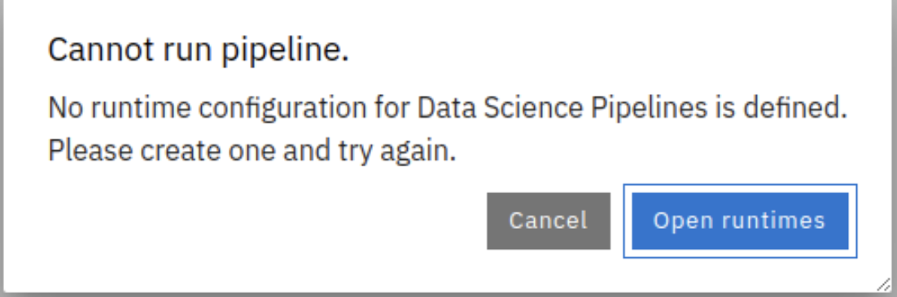

# Troubleshooting

## Runtimes missing from some DataSience projects 

  

**Solution** 
~
* Delete Workbench
* Check if pipelineserver is running
* Recreate Workbench

## Red Hat Service Internect problems

### Check Site controller pods

```bash
oc logs -n openshift-operators deployment/skupper-site-controller
```

If you see something like this
```
2025/01/24 14:06:52 Initialising skupper site ...
2025/01/24 14:06:52 Error initialising skupper: OpenShift cluster not detected for --ingress type route
E0124 14:06:52.543358 1 controller.go:204] OpenShift cluster not detected for --ingress type route
2025/01/24 14:06:54 Handling token request for red-hat-service-interconnect-data-center/edge-gateway
2025/01/24 14:06:54 Generating token for request edge-gateway...
2025/01/24 14:06:54 Failed to generate token for request edge-gateway: Skupper is
```

=> Restart the pod

## Runtimes missing from some DS projects 

In short: Re-create workbench

* Delete Workbench
* Check if pipeline server is running
* Recreate Workbench
** Use the pre-existing PVC
